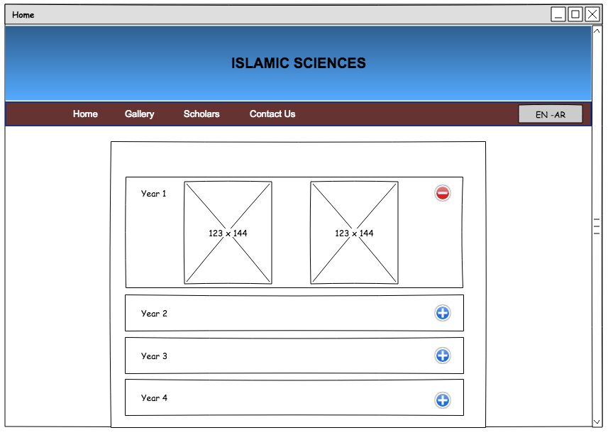
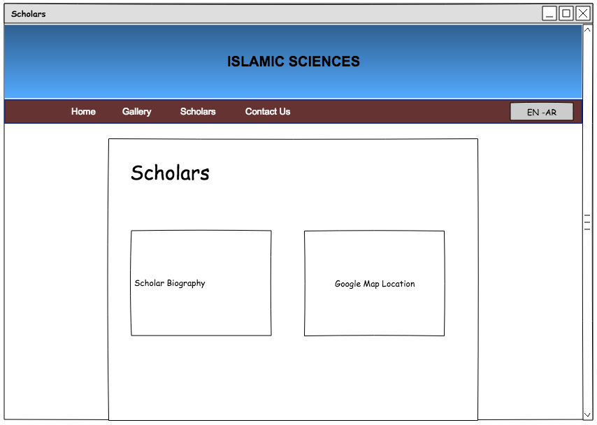
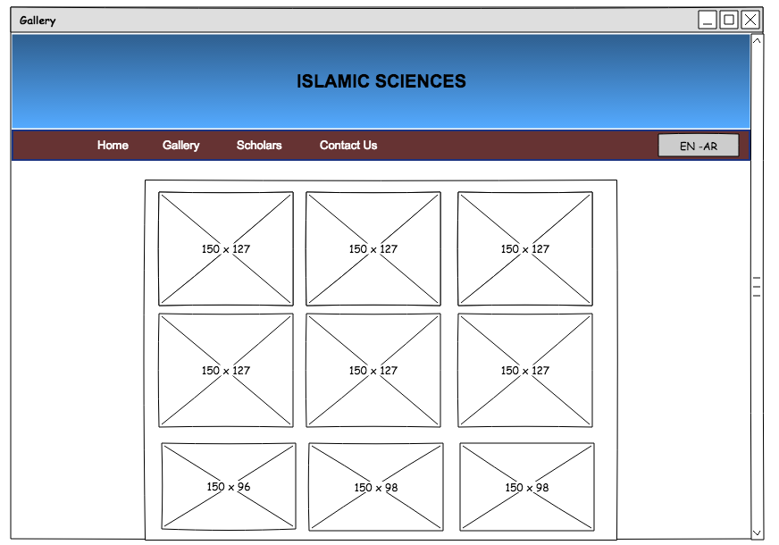
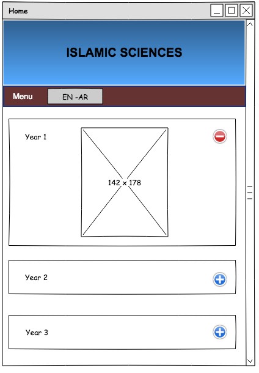

# Islamic Studies Website
- - -
###### CTEC3905 Front End Web App Development - Assignment 2
###### Zakir Ahmed - P14125980 - Computer Science

[&larr; Back to Home](../README.md)

- - -

# Final Designs

## Home (Books)

Below is the wireframe design for my homepage. As drawn, there are accordion sections as well as a header and fixed nav bar.

* * *
## Scholars
This drawing is for the scholars section showing use of Google Maps API
Below in the design there is a drawing of Google Maps which is to be implemented in the Scholars section.

* * *
## Gallery
The Gallery drawing below is the final design of how the responsive layout would be to the gallery section.

* * *
## Mobile
The image below shows the fixed header and nav bar in the mobile version. The images have reduced to show only one in line as opposed to 2 or more. Also the menu items are hidden and only the new menu button shows.
