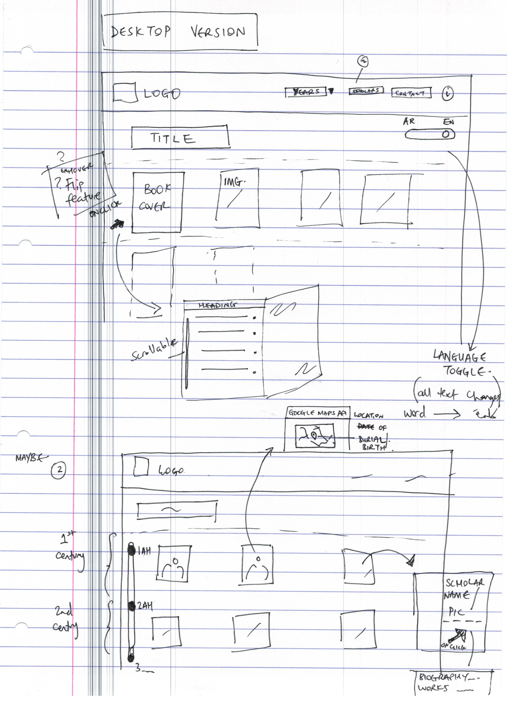

# Islamic Studies Website
- - -
###### CTEC3905 Front End Web App Development - Assignment 2
###### Zakir Ahmed - P14125980 - Computer Science

[&larr; Back to Home](../README.md)

- - -

# Initial Designs 1

These are the mobile first designs, showing the collapsed nav bar, section for books to scroll down and open modal bar.

* * *
# Initial Designs 2
The second design is for the desktop version, where the language toggle is introduced. Also the modal box is shown more larger here.

Below in the design there is a drawing of Google Maps which is to be implemented in the Scholars section.

